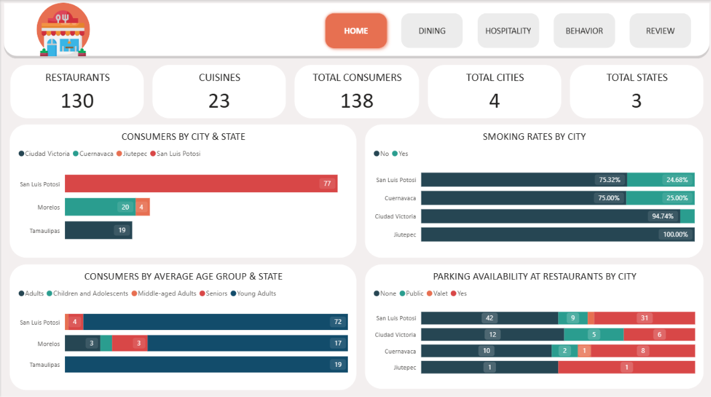
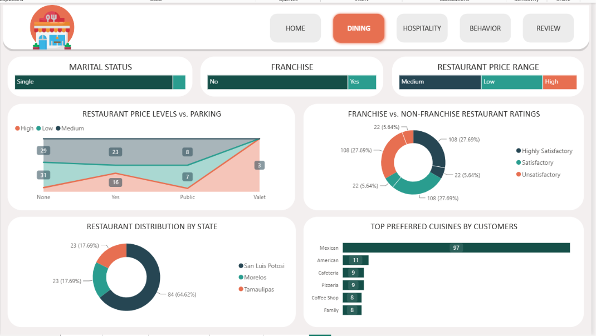
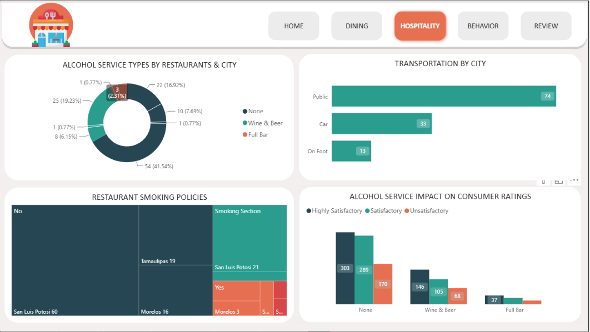
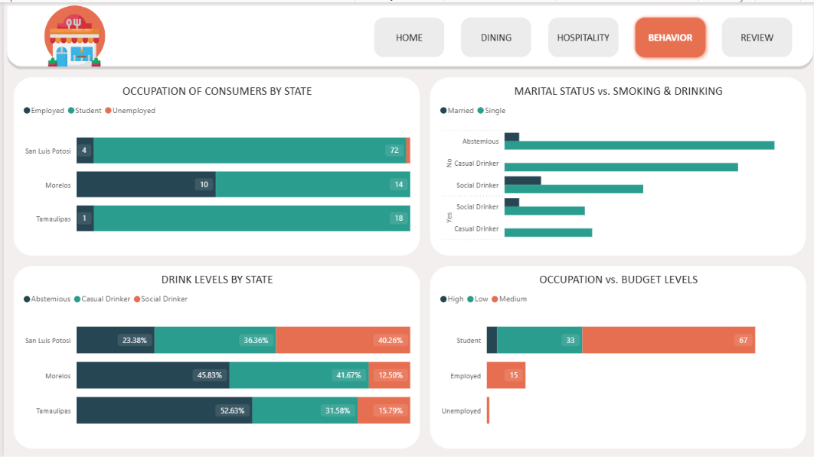
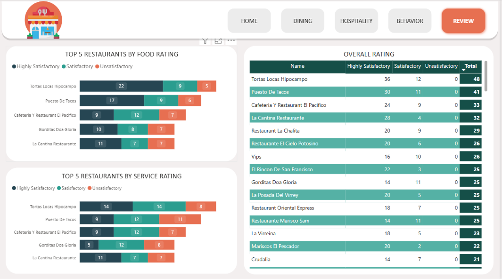

# 🍽️ Restaurant Ratings Analysis using Power BI

## 📊 Project Overview

This project analyzes restaurant ratings, customer preferences, demographics, dining behavior, and restaurant characteristics using Microsoft Power BI.

The objective is to transform raw restaurant and consumer data into an interactive business intelligence dashboard and generate meaningful insights to support data-driven decision-making.

---

## 🛠️ Tools & Technologies

- Microsoft Power BI
- Power Query
- DAX
- Data Cleaning
- Data Transformation
- Data Modeling
- Exploratory Data Analysis (EDA)
- Data Visualization
- Business Intelligence

---

## 📁 Dataset

The project contains multiple datasets related to restaurants, consumers, cuisines, and ratings.

### Main Tables

| Table | Description |
|---|---|
| Consumers | Consumer demographic and personal information |
| Consumer Preferences | Consumer cuisine preferences |
| Restaurants | Restaurant information and characteristics |
| Restaurant Cuisines | Cuisine information associated with restaurants |
| Ratings | Food, service, and overall restaurant ratings |
| Data Dictionary | Description of dataset columns and fields |

---

# 🧹 Data Cleaning & Transformation

Data cleaning and transformation were performed using **Power Query in Microsoft Power BI**.

## Steps to Import Data

1. Open Power BI Desktop.
2. Select **Get Data → More → Folder**.
3. Select the folder containing the dataset.
4. Click **Connect**.
5. Select **Transform Data**.
6. Load the required datasets.
7. Duplicate the required files where necessary.
8. Expand the **Binary** column to combine and import datasets.
9. Review and correct column data types.
10. Remove unnecessary columns.
11. Handle missing and inconsistent values.
12. Transform the data into analysis-ready formats.
13. Create calculated columns using DAX.
14. Prepare the cleaned data for data modeling and visualization.

---

# 🧮 DAX Calculated Fields

## Age Group

The Age column was transformed into meaningful age categories for demographic analysis.

```DAX
AgeGroup =
SWITCH(
    TRUE(),
    consumers[Age] <= 18, "Children and Adolescents",
    consumers[Age] <= 30, "Young Adults",
    consumers[Age] <= 45, "Adults",
    consumers[Age] <= 60, "Middle-aged Adults",
    "Seniors"
)
```

---

# 📊 Dashboard

The project contains a **5-page interactive Power BI dashboard**.

---

## 🏠 1. Home Dashboard

The Home page provides an overall summary of restaurant and consumer data.

### Visualizations

- Total Restaurants
- Total Cuisines
- Total Consumers
- Total Cities
- Total States
- Consumers by City and State
- Smoking Rates by City
- Consumers by Average Age Group and State
- Parking Availability at Restaurants by City

---

## 🍴 2. Dining Dashboard

The Dining page analyzes restaurant pricing, customer preferences, and dining characteristics.

### Visualizations

- Marital Status
- Restaurant Price Range
- Restaurant Price Levels vs Parking
- Franchise vs Non-Franchise Restaurant Ratings
- Restaurant Distribution by State
- Top Preferred Cuisines by Customers

---

## 🏨 3. Hospitality Dashboard

The Hospitality page analyzes restaurant services and hospitality-related factors.

### Visualizations

- Alcohol Service Types by Restaurant and City
- Transportation by City
- Restaurant Smoking Policies
- Alcohol Service Impact on Consumer Ratings

---

## 👥 4. Behavior Dashboard

The Behavior page focuses on consumer demographics and lifestyle behavior.

### Visualizations

- Occupation of Consumers by State
- Marital Status vs Smoking & Drinking
- Drink Levels by State
- Occupation vs Budget Levels

---

## ⭐ 5. Review Dashboard

The Review page evaluates restaurant performance based on customer ratings.

### Visualizations

- Top 5 Restaurants by Food Rating
- Top 5 Restaurants by Service Rating
- Overall Restaurant Ratings
- Restaurant Rating Categories
- Detailed Restaurant Rating Comparison

---

# 🔍 Key Insights

- Mexican cuisine is one of the most preferred cuisine categories among customers.
- San Luis Potosi has the highest number of consumers among the analyzed states.
- Public transportation is the most commonly used transportation method.
- Restaurant smoking policies vary across cities and states.
- Alcohol service can be compared with customer satisfaction levels.
- Restaurant performance can be evaluated using food, service, and overall ratings.
- Restaurant price levels can be analyzed against parking availability.
- Consumer behavior varies across occupation, budget, smoking, and drinking categories.

---

# 📸 Dashboard Preview

## 🏠 Home Dashboard



---

## 🍴 Dining Dashboard



---

## 🏨 Hospitality Dashboard



---

## 👥 Behavior Dashboard



---

## ⭐ Review Dashboard



---

# 🎯 Skills Demonstrated

- Data Cleaning
- Data Transformation
- Power Query
- DAX
- Data Modeling
- Exploratory Data Analysis
- KPI Development
- Interactive Dashboard Development
- Data Visualization
- Business Intelligence
- Business Insights

---

# 🚀 Project Outcome

Developed an interactive 5-page Power BI dashboard to analyze restaurant performance, customer demographics, preferences, dining behavior, hospitality factors, and satisfaction levels.

This project demonstrates an end-to-end **Data Analyst workflow**, from raw data cleaning and transformation to data modeling, analysis, visualization, and business insight generation.

---

## 📌 Project Files

- `Restaurant Ratings power bi Analysis.pbix` — Power BI dashboard file
- `Dashboard/` — Dashboard screenshots
- `Dataset/` — Source datasets
- `README.md` — Project documentation
